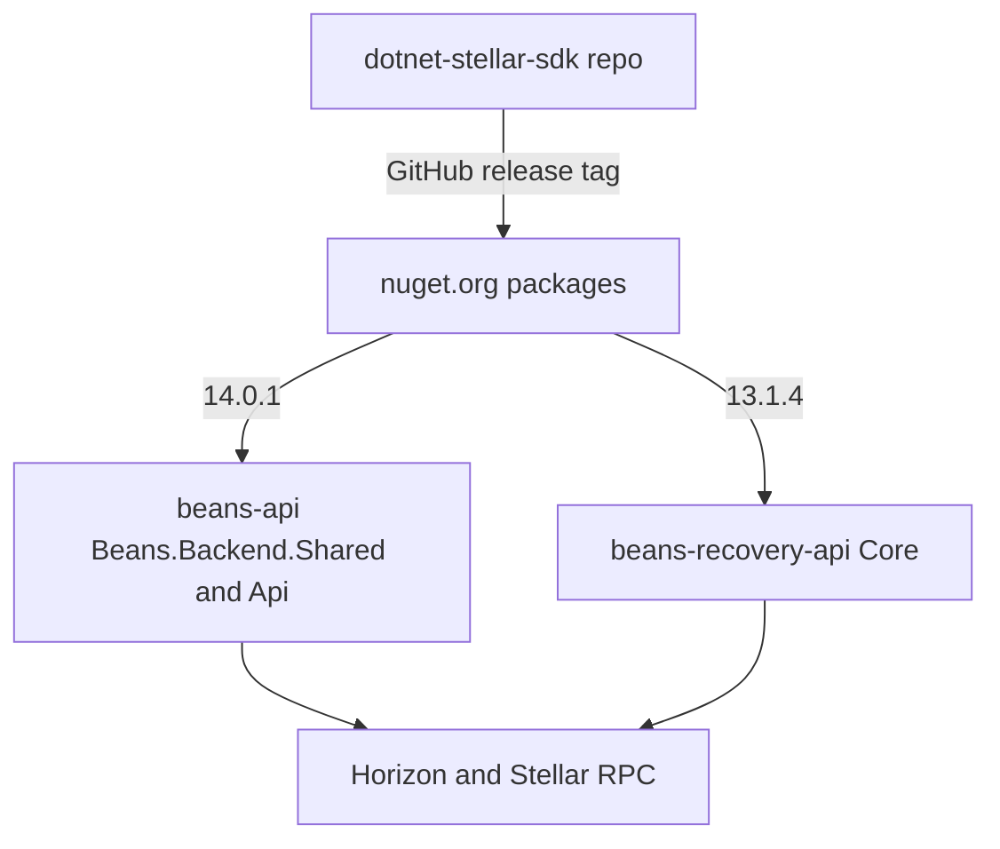

# dotnet-stellar-sdk — Architecture

> See also: the cross-repo Beans platform overview in the beans-api repo, [`beans-api/docs/architecture/system-overview.md`](../beans-api/docs/architecture/system-overview.md) (link assumes side-by-side checkout).

## What this repo is

The Beans-BV-maintained .NET SDK for the Stellar network (Horizon + Stellar RPC/Soroban), published to
nuget.org as two packages: `stellar-dotnet-sdk` (`StellarDotnetSdk/StellarDotnetSdk.csproj`) and
`stellar-dotnet-sdk-xdr` (`StellarDotnetSdk.Xdr/StellarDotnetSdk.Xdr.csproj`). It originated as a port of the
Java SDK, with SEP implementations ported from the Soneso Flutter SDK (`README.md`). Apache-2.0 licensed
(`LICENSE.txt`), public open-source project — this is the one Beans repo built for external consumers as well.

## System position

Both Beans .NET backends consume this SDK as a NuGet package (not a project reference). The Flutter app does
**not** use it — it uses the unrelated Dart `stellar_flutter_sdk` (Beans fork, pinned in beans-app root
`pubspec.yaml` `dependency_overrides`).

Exact versions referenced (verified in the consumers):

| Consumer | File | Version |
|---|---|---|
| beans-api | `Beans.Backend.Shared/Beans.Backend.Shared.csproj`, `Api/Api.csproj` | 14.0.1 |
| beans-api (orphan) | `Beans.Backend.Shared/Stellar/StellarConnector.csproj` | 7.2.18 — this csproj is **not** in `beans-api.sln` and is referenced by no other project; it is a leftover, the 7.x pin does not affect the build |
| beans-recovery-api | `Core/Core.csproj` | 13.1.4 |

The `<Version>` in `StellarDotnetSdk/StellarDotnetSdk.csproj` (12.0.0 at time of writing) is **not** the
release version: `.github/workflows/publish_nuget.yml` overrides it with `-p:PackageVersion=` taken from the
GitHub release tag.

## Layout (`stellar-dotnet-sdk.sln`)

- `StellarDotnetSdk/` — the SDK: `Server.cs` (Horizon), `Soroban/` (Stellar RPC), `Requests/` + `Responses/`
  (request-builder pattern: `*RequestBuilder` → HttpClient → Horizon; never bypass layers), `Transactions/`,
  `Operations/`, `Crypto/`, `Sep/` (SEP-0001/0006/0009/0010/0024/0045), `Compatibility/` (Horizon/RPC/SEP
  coverage matrices), `WebAuthentication.cs` (SEP-10)
- `StellarDotnetSdk.Xdr/` — generated XDR types; **read-only**, regenerated from `.x` files via
  `StellarDotnetSdk.Xdr/xdr-generator/` (see `.github/instructions/generated-code.instructions.md`)
- `StellarDotnetSdk.Tests/` — offline unit tests, MSTest + Moq + FluentAssertions, ~200 test files, fixtures
  in `TestData/`
- `StellarDotnetSdk.NetStandard21.Tests/` — same unit suite compiled against the `netstandard2.1` build of
  the SDK on a net8.0 host (`StellarDotnetSdk.NetStandard21.Tests/StellarDotnetSdk.NetStandard21.Tests.csproj`)
- `StellarDotnetSdk.IntegrationTests/` — NUnit, no mocks, runs against **live Stellar Testnet**; each test
  funds its own throwaway keypair via Friendbot (see `StellarDotnetSdk.IntegrationTests/README.md` for env
  overrides like `INTEGRATION_HORIZON_URL`)
- `Examples/Horizon/`, `Examples/Soroban/`, `StellarDotnetSdk.Console/` — runnable demos
- `docs/` — DocFX site source (`docs/docfx.json`), published to https://beans-bv.github.io/dotnet-stellar-sdk/
  — link there for API reference and tutorials instead of duplicating them

## Multi-TFM build

`stellar-dotnet-sdk` and `-xdr` multi-target `net10.0;net8.0;netstandard2.1`
(`StellarDotnetSdk/StellarDotnetSdk.csproj`); `netstandard2.1` exists for Unity/Tizen hosts. The Ed25519
backend differs per TFM: NSec.Cryptography on net8.0/net10.0, Sodium.Core on netstandard2.1, with
cross-provider known-answer tests enforcing equivalence (`CHANGELOG.md`). Building requires the .NET 10 SDK
(`global.json`). A few APIs differ per TFM (SEP-0009 `DateOnly?` vs `string?`, sync `HttpClient.Send` retry
support) — see "TFM-specific API notes" in `README.md`.

## Networks & environments

The SDK itself is network-agnostic: a `Network` is just a passphrase (`StellarDotnetSdk/Network.cs`, with
`Network.Test()` / `Network.Public()` static factories), and the Horizon/RPC URLs are constructor arguments to
`Server` / `StellarRpcServer` (`SorobanServer` still exists as a deprecated alias). Which Stellar network an
environment talks to is decided entirely by the consumers' config:

- beans-api: `Data/Services/HorizonService.cs` does `new Network(settings.NetworkName)`;
  beans-recovery-api: `Data/Services/TransactionService.cs` line 39, same pattern.
- The checked-in `Bootstrap/appsettings.json` of **both** backends defaults to the testnet passphrase
  (`Stellar:NetworkName`) and testnet Horizon URLs (beans-api additionally a testnet Stellar RPC URL;
  beans-recovery-api has no RPC config) — that is the local-dev setup. Neither repo checks in
  `appsettings.Staging.json`/`appsettings.Production.json`; staging/prod values are injected at deploy time
  (outside these repos).

**Local setup chain for this repo: none.** Unlike the beans backends, the SDK needs no beans-database, no
sibling API, no secrets — clone, install the .NET 10 SDK (`global.json`), `dotnet build`, `dotnet test`.
Only the integration test project needs anything external (internet access to live Testnet).

**Testing a local SDK change inside a Beans backend:** there is no checked-in shortcut. The consumers
reference the SDK strictly as a NuGet package (beans-api `NuGet.Config` lists only nuget.org and the private
Baseflow GitHub feed — no local folder feed, no `ProjectReference`). Changes reach beans-api/beans-recovery-api
only via GitHub release → nuget.org → version bump in the consumer csproj; for a quick local experiment you
must `dotnet pack` and wire up a local package source yourself.

## Key flows

- **Horizon**: `Server` + `*RequestBuilder` for queries and `SubmitTransaction()`; SSE streaming via
  LaunchDarkly.EventSource (`StellarDotnetSdk/EventSources/`).
- **Soroban**: `StellarDotnetSdk/Soroban/` Stellar RPC client (JSON-RPC over POST), used by beans-api for
  DeFindex vaults; recent work adds Protocol 27 / CAP-71 authorization (`CHANGELOG.md`).
- **HTTP resilience**: opt-in Polly-based retry presets `ForHorizon()` / `ForSoroban()` in
  `HttpResilienceOptionsPresets`; deliberately **not** for SEP clients — SEP-10/24 POSTs are one-shot
  (rationale in `README.md`, "HTTP retry & resilience").

## Error & edge flows

Most SDK exception types live in `StellarDotnetSdk/Exceptions/`; a few sit next to their feature
(`Federation/ConnectionErrorException.cs`, `Sep/*/Exceptions/`). The ones callers actually hit:

- **Transaction submission** (`Server.cs`, private `SubmitTransaction<T>` → `HandleResponse`): Horizon
  200/201/**400** all deserialize into `SubmitTransactionResponse` — a transaction *rejected by the network*
  is a normal return value, not an exception. Check `IsSuccess` (defined as `Ledger != null`,
  `Responses/SubmitTransactionResponse.cs`) and decode `ResultXdr` for the failure code. Exceptions are
  reserved for transport-level problems: 503 → `ServiceUnavailableException` and 429 →
  `TooManyRequestsException` (both carry the `Retry-After` header value), 504 →
  `SubmitTransactionTimeoutResponseException` (submission status unknown — do not blindly resubmit),
  anything else → `SubmitTransactionUnknownResponseException`. Setting
  `SubmitTransactionOptions.EnsureSuccess` instead throws `ConnectionErrorException` on any non-2xx.
- **SEP-29 memo check**: every submit of a memo-less transaction first loads each payment-destination
  account and throws `AccountRequiresMemoException` if it has `config.memo_required` set (`Server.cs`,
  `CheckMemoRequired`); transactions that already carry a memo skip the lookup, as does setting
  `SubmitTransactionOptions.SkipMemoRequiredCheck`.
- **Queries**: `Requests/ResponseHandler.cs` maps 503/429 to the same two retryable exceptions, other
  non-success codes to `HttpResponseException`, and an empty body to `ClientProtocolException`.
- **Signing without a network**: the network-less overloads fall back to the static `Network.Current` (set
  via `Network.UseTestNetwork()`/`UsePublicNetwork()`; `Transactions/TransactionBase.cs`). When it is unset,
  `Sign(IAccountId)` throws `ArgumentNullException` ("network cannot be null"), while the parameterless
  `Hash()`/`SignatureBase()` paths throw `NoNetworkSelectedException` (thrown from the
  `SignatureBase(network)` overrides in `Transactions/Transaction.cs` / `FeeBumpTransaction.cs`).

## CI / release

- `.github/workflows/pack_and_test.yml` — PRs + main: restore, build all TFMs, pack, run the unit suite on
  net10.0, net8.0, and the netstandard2.1 build. Integration tests do **not** run on PRs.
- `.github/workflows/integration_tests.yml` — main pushes, `v*` tags, manual dispatch; live-Testnet suite
  with a 40-minute job timeout.
- `.github/workflows/publish_nuget.yml` — on GitHub release publish: pack with the tag as package version,
  validate, push to nuget.org.
- `.github/workflows/update-documentation.yml` — on release: DocFX build → `gh-pages` branch.

Contributor conventions live in `.github/instructions/` (per-topic instruction files, e.g.
`project-context.instructions.md`, `testing-patterns.instructions.md`) — this repo's equivalent of a CLAUDE.md.

## Operational notes

> Security-sensitive findings (secret handling, key management, auth hardening) are tracked in a separate internal security review and are intentionally not included here.

- Build: `dotnet build stellar-dotnet-sdk.sln`. Test suites, each runnable with
  `dotnet test <project>/<project>.csproj`:
  - `StellarDotnetSdk.Tests` — offline unit suite, the default pre-commit gate;
  - `StellarDotnetSdk.NetStandard21.Tests` — same tests against the `netstandard2.1` build;
  - `StellarDotnetSdk.IntegrationTests` — live Testnet, needs internet; can be `Inconclusive` under Friendbot
    rate limits — by design; env overrides (`INTEGRATION_HORIZON_URL`, `INTEGRATION_STELLAR_RPC_URL`, …) in
    `StellarDotnetSdk.IntegrationTests/README.md`.
- Stellar Testnet resets roughly quarterly; the integration suite is reset-proof (fresh keypairs per test),
  but downstream beans-api seed data is not (see beans-api `Data/DataSeeder.cs` note in its own docs).
- The XDR classes sit directly in the `StellarDotnetSdk.Xdr/` project root — never edit them by hand.
  Regenerate: update the `.x` schemas in `StellarDotnetSdk.Xdr/schemes/` (from stellar/stellar-xdr), then run
  `StellarDotnetSdk.Xdr/xdr-generator/generate.sh` (Ruby 3.4+ + Bundler; details and generator snapshot tests
  in `StellarDotnetSdk.Xdr/xdr-generator/README.md`).
- JSON invariant: every `JsonSerializer.Serialize/Deserialize` call must pass `JsonOptions.DefaultOptions`
  (custom converters break otherwise). `scripts/check-json-serializer.sh` checks this, but despite its header
  comment it is wired into **no** workflow in `.github/workflows/` — run it manually.

## Open questions

- Why beans-recovery-api pins 13.1.4 while beans-api is on 14.0.1 is not documented anywhere — presumably
  pending upgrade work (the 13→14 major bump implies breaking changes under the repo's semver policy,
  `.github/instructions/semantic-versioning.instructions.md`; note the checked-in `CHANGELOG.md` only
  documents `[Unreleased]` work, not the released 14.x history), but no issue/ADR states this.
- `beans-api/Beans.Backend.Shared/Stellar/StellarConnector.csproj` (SDK 7.2.18) is dead weight outside the
  solution; whether it is kept intentionally (history? planned extraction?) is unknown — candidate for removal.
- `StellarDotnetSdk/StellarDotnetSdk.csproj` carries `<Version>12.0.0</Version>` while releases are already at
  14.x via tag override; whether the in-repo version is meant to track releases is unclear.
- Two unreferenced leftovers in the repo root: `appveyor.yml` (references stale artifact/test paths like
  `stellar-dotnet-sdk\**` and `./stellar-dotnet-sdk-test` that no longer exist in the current layout — the
  active CI is GitHub Actions) and
  `packages-microsoft-prod.deb` (referenced by nothing in the repo). Both look removable.
